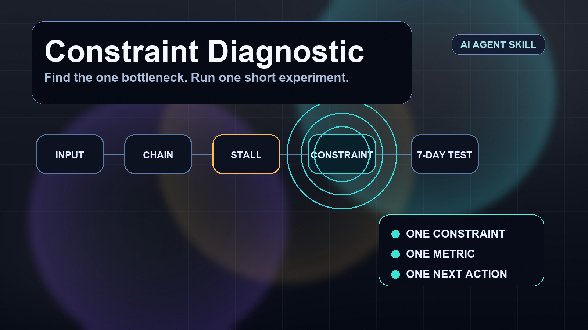

# Constraint Diagnostic Skill



An AI-agent skill for finding the single constraint blocking an outcome, then turning it into one short experiment.

Use it when a situation feels stuck and you need a clear diagnostic instead of a list of priorities.

## Command

```text
/constraint [situation]
```

Aliases, if configured:

```text
/bottleneck [situation]
/goldratt [situation]
```

## What it does

- Checks whether there is enough context to diagnose
- Runs a short interview only when context is missing
- Identifies one constraint, not a priority list
- Pushes back on fake bottlenecks
- Produces a 7-day experiment and one metric

## Works for

- sales and business development
- client acquisition
- client diagnostics
- personal systems
- content loops
- AI agent workflows

## Input template

```text
/constraint
Outcome:
Context:
Current chain:
Symptoms:
Numbers:
What I think it is:
Question:
```

You do not need to fill every field. The agent should ask only for missing context when needed.

## Output format

```text
CONSTRAINT
[One sentence naming the single constraint.]

WHY THIS ONE
[2-4 bullets using the chain, pile-up, lock-in test, and any numbers.]

CONFIDENCE
[High / Medium / Low] — [one sentence why]

ASSUMPTIONS / MISSING CONTEXT
[State assumptions or missing facts.]

NOT THE CONSTRAINT
[The tempting false bottleneck and why it is not primary.]

7-DAY EXPERIMENT
[One cheap test.]

METRIC
[One number to track.]

NEXT ACTION TODAY
[One concrete action.]
```

## Files

- `SKILL.md` — the skill instructions
- `README.md` — this overview
- `assets/constraint-diagnostic-hero.png` — README hero image

## License

MIT. Use, adapt, and share it.
